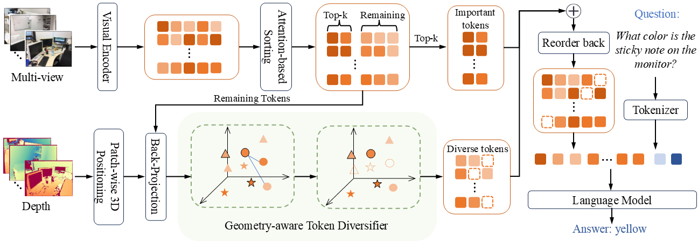
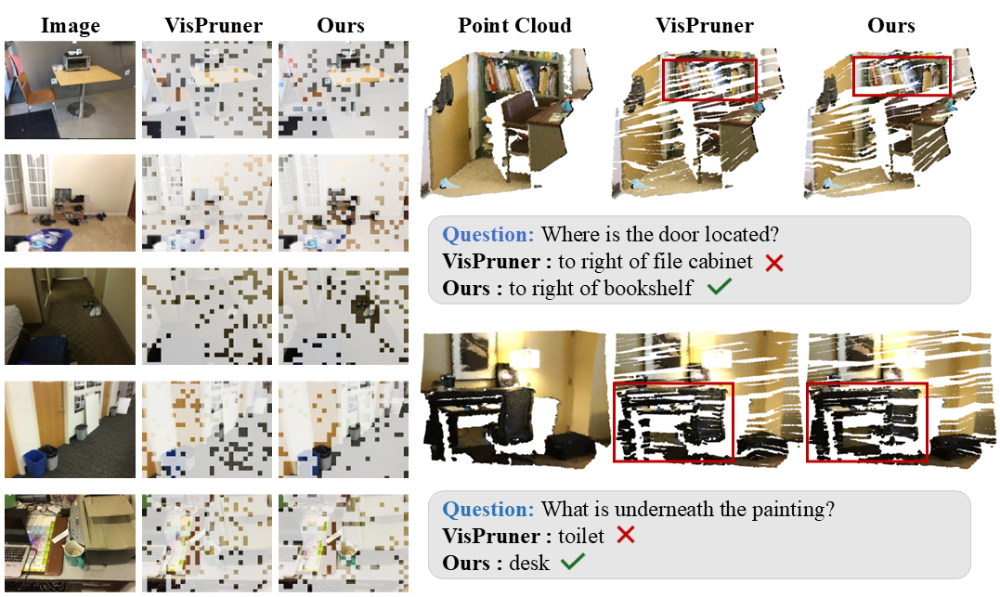

# 🧊 SeGPruner: Semantic–Geometric Visual Token  Pruner for 3D Question Answering
*A semantic-aware and geometry-guided token reduction framework for efficient multi-view 3D question answering.*
[](https://github.com/intcomp/SegPruner)

---

## 🏠 Abstract
Vision–language models (VLMs) have been widely adopted for 3D question answering (3D QA). In typical pipelines, visual tokens extracted from multiple viewpoints are concatenated with language tokens and jointly processed by a large language model (LLM) for inference. However, aggregating multi-view observations inevitably introduces severe token redundancy, leading to an overly large visual token set that significantly hinders inference efficiency under constrained token budgets. Visual token pruning has emerged as a prevalent strategy to address this issue. Nevertheless, most existing pruners are primarily tailored to 2D inputs or rely on indirect geometric cues, which limits their ability to explicitly retain semantically critical objects and maintain sufficient spatial coverage for robust 3D reasoning. In this paper, we propose **SeGPruner**, a semantic-aware and geometry-guided token reduction framework for efficient 3D QA with multi-view images. Specifically, **SeGPruner** first preserves semantically salient tokens through an attention-based importance module (Saliency-aware Token Selector), ensuring that object-critical evidence is retained. It then complements these tokens with spatially diverse ones via a geometry-guided selector (Geometry-aware Token Diversifier), which jointly considers semantic relevance and 3D geometric distance. This cooperation between saliency preservation and geometry-guided diversification balances object-level evidence and global scene coverage under aggressive token reduction. Extensive experiments on ScanQA and OpenEQA demonstrate that **SeGPruner** substantially improves inference efficiency, reducing the visual token budget by 91% and inference latency by 86%, while maintaining competitive performance in 3D reasoning tasks.

## 👁️ Overall architecture

Our module is inserted between the visual encoder and the LLM and consists of three components: (1) *3D-Aware Feature Construction*, (2) *Salient Token Selection*, and (3) *Diverse Token Selection*. Initially, the visual encoder extracts 2D visual tokens from multi-view inputs, where darker colors indicate higher attention scores. We select the top-*k* tokens as *important tokens*. To preserve spatial context, the remaining tokens are back-projected into 3D space using the corresponding depth map and processed by the *Geometry-aware Token Diversifier* to obtain *diverse tokens*. In the Geometry-aware Token Diversifier, tokens sharing the same shape originate from the same input view. Dashed outlines denote tokens discarded during selection. Finally, the important and diverse tokens are concatenated and fed into the LLM for cross-modal reasoning.

## 🔧 Installation
### 1. Clone the repository
```bash
git clone --recursive https://github.com/intcomp/SegPruner.git
cd SegPruner
cd LLaVA-NeXT
git am ../patches/*.patch
```

### 2. Install the inference package
```bash
# following the project llava
conda create -n segpruner python=3.10 -y
conda activate segpruner
pip install --upgrade pip
pip install -e ".[train]"
```
### 3. (Optional) Install FlashAttention for further inference acceleration.
```bash
pip install flash-attn --no-build-isolation
```

## 🗂 Dataset
### ScanQA
We follow the project of [ScanQA](https://github.com/ATR-DBI/ScanQA/blob/main/docs/dataset.md) for data preparation.

1. Download the [ScanQA dataset](https://drive.google.com/drive/folders/1-21A3TBE0QuofEwDg5oDz2z0HEdbVgL2) under data/ScanQA/qa/
2. Download and unzip [the extracted ScanNet frames](http://kaldir.vc.in.tum.de/3dsis/scannet_train_images.zip) under `data/ScanQA/scannetv2`
### OpenEQA
We follow the project of [OpenEQA](https://github.com/facebookresearch/open-eqa/blob/main/data/README.md) for data preparation.
1. Prepare the dataset and place it under `data/openeqa/`

### LLAVA-OV model
Download the **LLAVA-OV** pretrained model to `data/model/`
```bash
sudo apt-get install git-lfs
git lfs install
git clone https://huggingface.co/lmms-lab/llava-onevision-qwen2-7b-ov.git
```

After preparing, your `data/` folder should look like:
```
|-ScanQA
	|-qa
		|-ScanQA_v1.0_train.json
		|-ScanQA_v1.0_val.json
		|-ScanQA_v1.0_test_w_obj.json
		|-ScanQA_v1.0_test_wo_obj.json
	|-scannetv2
		|-frames_square
			|-scene0000_00
				|-color
				|-depth
				|-...
			|-scene0000_01
			|-......
|-model
	|-llava-onevision-qwen2-7b-ov
|-openeqa
    |- frames
    	|-hm3d-v0
    		|-000-hm3d-BFRyYbPCCPE
    		|-...
		|- scannet-v0
			|- 002-scannet-scene0709_00
			|- ...
		|- raw
    |-open-eqa-v0.json
```
## 📋️ Evaluation
The main implementation of SeGPruner is highlighted with `[SeGPruner]` annotations. Patches modify the following upstream files (see `patches/` for details): [`llava_qwen.py`](LLaVA-NeXT/llava/model/language_model/llava_qwen.py), [`llava_arch.py`](LLaVA-NeXT/llava/model/llava_arch.py) and [`siglip_encoder.py`](LLaVA-NeXT/llava/model/multimodal_encoder/siglip_encoder.py).
### Dataset Preparation
Use `scripts/image_simpling.py` to uniformly sample 12 images per scene for ScanQA and OpenEQA.
### Running Evaluation
We provide scripts to run evaluations for each dataset.
#### ScanQA
```bash
python scripts/eval_fps.py \
  --visual_token_num <NUM_TOKENS> \
  --r <IMPORTANT_RATIO>
```
#### OpenEQA
```bash
python scripts/eval_openeqa.py \
  --visual_token_num <NUM_TOKENS> \
  --r <IMPORTANT_RATIO>
```

## 🖼️ Qualitative Results
**Left**: retained tokens mapped onto the original image, with transparent areas denoting the selected tokens. Our method achieves a more even spatial distribution of tokens in the image plane, thereby offering a more complete set of visual cues. 
**Right**: retained tokens projected into 3D space. Our approach produces a more continuous and complete point distribution, better capturing object structures with fewer holes and higher geometric completeness.


## Related Projects

- This code is based on [LLaVA-NeXT](https://github.com/LLaVA-VL/LLaVA-NeXT)
- [ScanQA](https://github.com/ATR-DBI/ScanQA/tree/main)
- [OpenEQA](https://github.com/facebookresearch/open-eqa)